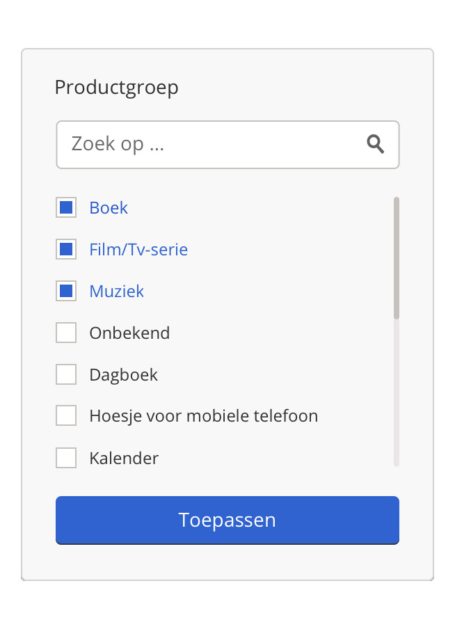

# Multi-Select Filter

This project is a Frontend Developer Assessment that demonstrates the implementation of a multi-select filter. Below is a visual reference for how the filter should look:



---

## Architecture & Design Decisions

This project follows a modular architecture using a monorepo layout:

```
/
├── client/         # Vite-based React app
│   ├── components/ # UI components (ItemList, SearchInput, etc.)
│   ├── features/   # State logic (selection hook, provider)
│   ├── graphql/    # Codegen, queries, and GraphQL config
│   └── utils/      # HTML decoder, helpers
└── server/         # Apollo GraphQL server
└── src/        # Schema, resolvers, static JSON data

```

### Key Decisions

- **GraphQL over REST**: Enables flexible data queries, better suited for future extensions.
- **Apollo Client**: Simplifies caching, error handling, and declarative data fetching.
- **Type Safety**: `graphql-codegen` ensures consistent typings across client and server.
- **Fallback Strategy**: If the GraphQL server is unreachable, the client falls back to a local JSON list.
- **Component Isolation**: Components are modular and individually testable (e.g., `SearchInput`, `SelectedTags`).
- **Persistent State**: Selected items are stored in `localStorage`.

---

## Getting Started

### Prerequisites

- Node.js ≥ 20
- npm ≥ 10

---

### Install dependencies

You can install all dependencies with a single command:

```bash
npm run install:all
```

Or install them separately by navigating into each directory:

```bash
# Install client dependencies
cd client && npm install

# Install server dependencies
cd server && npm install
```

---

### Run the app (client + server)

```bash
npm run dev
```

### Run client or server individually

```bash
npm run dev:client  # Starts Vite client
npm run dev:server  # Starts Apollo server (port 4000)
```

### Build client

```bash
cd client
npm run build
```

---

## Testing

### Unit & Integration Tests

```bash
cd client
npm run test
```

### Test coverage

```bash
npm run test:coverage
```

### Storybook

```bash
npm run storybook
```

Storybook includes component examples for `ItemRow`, `SearchInput`, and `SelectedTags` and is integrated with Vitest for testing.

---

## Challenges & Solutions

| Challenge                            | Solution                                                                                             |
| ------------------------------------ | ---------------------------------------------------------------------------------------------------- |
| Handling HTML entities like `&amp;`  | Implemented a `decodeHtml()` utility to decode entities before rendering                             |
| Fallback for server outages          | Loaded static JSON (`items.json`) locally when GraphQL fetch fails                                   |
| Performance on large lists           | Integrated **React Virtualization** (`react-virtual`) for faster rendering                           |
| Selection state lost on page refresh | Used **localStorage hydration** inside a context provider to persist selected filters across reloads |
